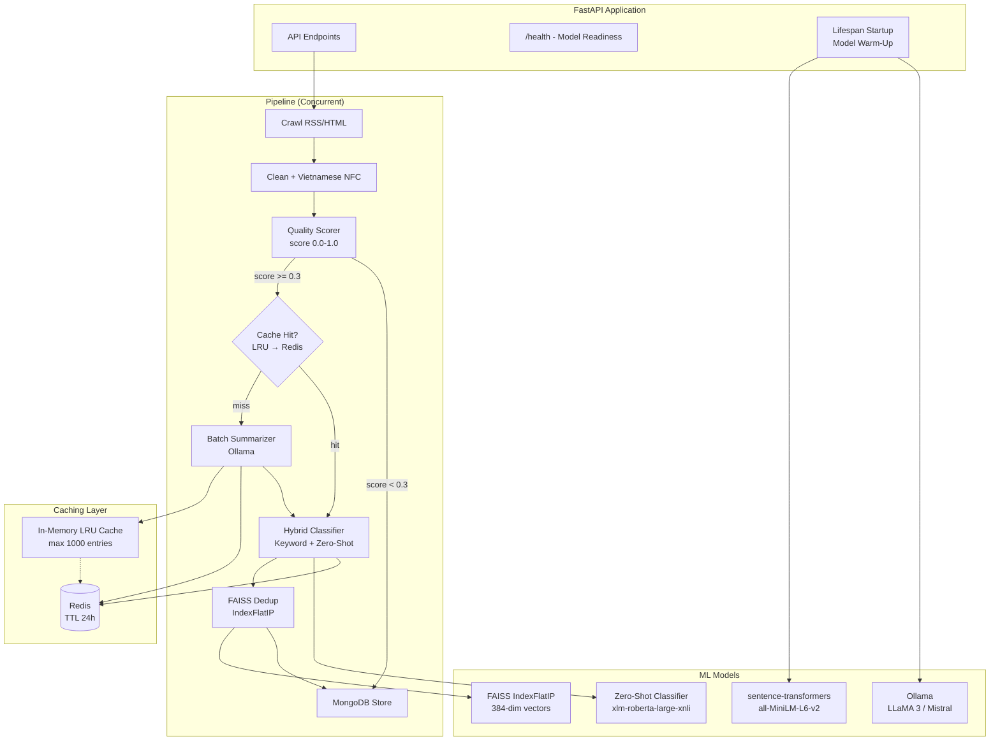
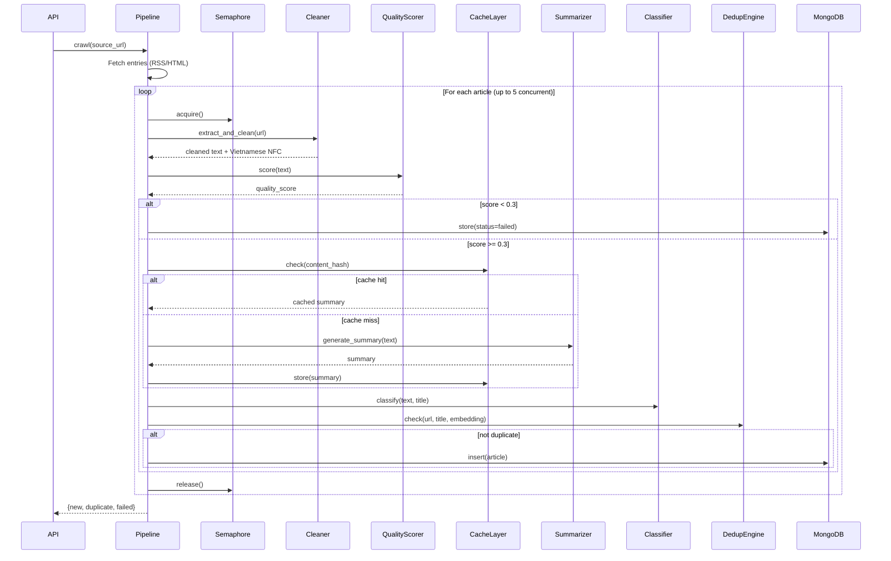

# Design Document: TrendBrief AI Engine Performance

## Overview

This design addresses 10 performance and quality improvements to the `trendbriefai-engine` Python/FastAPI service. The current engine processes articles sequentially (1.5s delay per article), uses lazy model loading, has no AI response caching, and relies solely on keyword-based classification. These changes introduce batch processing, multi-level caching (LRU + Redis), model warm-up, hybrid classification (keyword + zero-shot), FAISS-accelerated deduplication, concurrent pipeline execution, Vietnamese text improvements, and content quality scoring — all using free, local Python AI tools.

### Key Design Decisions

1. **Two-level cache (LRU + Redis)**: In-memory LRU provides sub-millisecond hits for hot entries; Redis provides persistence across restarts and cross-instance sharing. LRU is checked first, Redis second, Ollama last.
2. **Hybrid classifier with lazy zero-shot**: The zero-shot model (`joeddav/xlm-roberta-large-xnli`) is only loaded when keyword confidence is low, avoiding ~2GB memory overhead when keywords suffice.
3. **FAISS IndexFlatIP**: Uses inner product on L2-normalized vectors (equivalent to cosine similarity) for exact nearest-neighbor search. No approximate indexing needed at current scale (<50k articles/48h window).
4. **asyncio.Semaphore for concurrency**: Limits concurrent HTTP requests to external news sites while allowing CPU-bound AI tasks to overlap with I/O-bound crawling.
5. **Content quality scoring as a gate**: Runs before AI summarization to skip spam/low-quality content early, saving Ollama inference time.

## Architecture



### Pipeline Flow (Concurrent)



## Components and Interfaces

### 1. SummarizerCache (`services/cache/summarizer_cache.py`)

Manages two-level caching for summarization results.

```python
class SummarizerCache:
    """Two-level cache: in-memory LRU → Redis."""
    
    def __init__(self, max_lru_size: int = 1000, redis_ttl: int = 86400):
        self._lru: OrderedDict[str, dict] = OrderedDict()
        self._max_size: int = max_lru_size
        self._redis: Redis | None = None
        self._redis_ttl: int = redis_ttl
    
    async def connect_redis(self, redis_url: str) -> None: ...
    
    def _content_hash(self, text: str) -> str:
        """SHA-256 hash of truncated content for cache key."""
        ...
    
    async def get(self, content_text: str) -> dict | None:
        """Check LRU first, then Redis. Returns cached summary or None."""
        ...
    
    async def put(self, content_text: str, summary: dict) -> None:
        """Store in both LRU and Redis."""
        ...
```

### 2. BatchSummarizer (`services/summarizer.py` — enhanced)

Extends the existing summarizer with batch processing support.

```python
async def generate_summary_batch(
    texts: list[str],
    batch_size: int = 5,
    model_name: str | None = None,
) -> list[dict]:
    """Process multiple articles in batches via Ollama.
    
    Falls back to individual processing on batch failure.
    Falls back to extractive for unparseable individual results.
    """
    ...

async def generate_summary(
    clean_text: str,
    model_name: str | None = None,
    cache: SummarizerCache | None = None,
) -> dict:
    """Enhanced single-article summary with cache support.
    
    Returns dict with added 'from_cache' metadata flag.
    """
    ...
```

### 3. HybridClassifier (`services/classifier.py` — enhanced)

Adds zero-shot classification alongside existing keyword matching.

```python
class HybridClassifier:
    """Keyword + zero-shot hybrid topic classifier."""
    
    CONFIDENCE_THRESHOLD: int = 2  # min keyword hits before zero-shot
    KEYWORD_WEIGHT: float = 0.4
    ZERO_SHOT_WEIGHT: float = 0.6
    
    VIETNAMESE_LABELS: dict[str, str] = {
        "ai": "công nghệ và trí tuệ nhân tạo",
        "finance": "tài chính và kinh tế",
        "lifestyle": "phong cách sống và giải trí",
        "drama": "giải trí showbiz và mạng xã hội",
        "career": "nghề nghiệp và phát triển bản thân",
        "insight": "phân tích chuyên sâu và góc nhìn",
    }
    
    async def classify(self, text: str, title: str = "") -> str: ...
    def _keyword_scores(self, text: str, title: str) -> dict[str, float]: ...
    async def _zero_shot_scores(self, text: str) -> dict[str, float]: ...
    def _combine_scores(self, kw: dict, zs: dict) -> dict[str, float]: ...
```

### 4. FAISSDedup (`services/dedup/faiss_index.py`)

FAISS-accelerated embedding search replacing brute-force iteration.

```python
class FAISSIndex:
    """FAISS IndexFlatIP wrapper for dedup embedding search."""
    
    def __init__(self, dimension: int = 384):
        self._index: faiss.IndexFlatIP = faiss.IndexFlatIP(dimension)
        self._id_map: list[str] = []  # article_id at each FAISS position
        self._timestamps: list[datetime] = []
    
    def add(self, article_id: str, embedding: list[float], timestamp: datetime) -> None: ...
    def search(self, query_embedding: list[float], k: int = 10) -> list[tuple[str, float]]: ...
    def rebuild(self, window_hours: int = 48) -> int:
        """Remove expired entries and rebuild index. Returns removed count."""
        ...
    @property
    def size(self) -> int: ...
```

### 5. BatchEmbedding (`services/dedup/embedding.py` — enhanced)

Adds batch encoding to the existing embedding service.

```python
def encode_texts_batch(texts: list[str], max_chars: int = 4000) -> list[list[float]]:
    """Batch encode multiple texts into 384-dim normalized vectors.
    
    Single model.encode() call for the entire batch.
    Each text truncated to max_chars before encoding.
    """
    ...
```

### 6. ContentQualityScorer (`services/quality_scorer.py`)

Pre-summarization quality gate.

```python
@dataclass
class QualitySignals:
    length_score: float       # 0.0-1.0 based on text length adequacy
    structure_score: float    # 0.0-1.0 based on paragraph count/structure
    vietnamese_ratio: float   # ratio of Vietnamese chars to total
    spam_score: float         # 0.0-1.0 (0 = no spam, 1 = all spam)
    overall: float            # weighted combination

class ContentQualityScorer:
    THRESHOLD: float = 0.3
    
    def score(self, text: str) -> QualitySignals: ...
    def _length_score(self, text: str) -> float: ...
    def _structure_score(self, text: str) -> float: ...
    def _vietnamese_ratio(self, text: str) -> float: ...
    def _spam_score(self, text: str) -> float: ...
```

### 7. VietnameseTextCleaner (`services/cleaner.py` — enhanced)

Enhanced cleaning with Vietnamese-specific patterns.

```python
# New Vietnamese-specific patterns
VN_ARTIFACTS: list[re.Pattern] = [
    re.compile(r"(Đọc thêm|Xem thêm|Tin liên quan|Bài liên quan)\s*:.*", re.IGNORECASE),
    re.compile(r"(Nguồn|Theo)\s*:.*$", re.MULTILINE | re.IGNORECASE),
    re.compile(r"©.*$", re.MULTILINE),
    # social sharing fragments, copyright blocks
]

def clean_vietnamese_artifacts(text: str) -> str:
    """Strip Vietnamese web artifacts, boilerplate, repeated paragraphs."""
    ...

def clean_html(raw_html: str) -> str:
    """Enhanced: now includes Vietnamese artifact removal and NFC normalization."""
    ...
```

### 8. ModelWarmUp (`api.py` — enhanced lifespan)

Pre-loads models at startup and exposes readiness via `/health`.

```python
@asynccontextmanager
async def lifespan(app: FastAPI):
    """Enhanced startup: DB + model warm-up."""
    await connect_db()
    
    # Warm sentence-transformer
    model_status = {"sentence_transformer": "loading", "ollama": "checking"}
    try:
        from services.dedup.embedding import _get_model
        _get_model()  # Force load
        model_status["sentence_transformer"] = "ready"
    except Exception:
        model_status["sentence_transformer"] = "fallback"
    
    # Warm Ollama
    try:
        await _ping_ollama()
        model_status["ollama"] = "ready"
    except Exception:
        model_status["ollama"] = "fallback"
    
    app.state.model_status = model_status
    yield
    await close_db()
```

### 9. RedisAICache (`services/cache/redis_cache.py`)

Unified Redis caching for all AI results.

```python
class RedisAICache:
    """Redis cache for AI results with namespace prefixes."""
    
    SUMMARY_PREFIX = "ai:summary:"
    CLASSIFY_PREFIX = "ai:classify:"
    
    def __init__(self, redis_url: str, default_ttl: int = 86400): ...
    
    async def get_summary(self, content_hash: str) -> dict | None: ...
    async def put_summary(self, content_hash: str, summary: dict) -> None: ...
    async def get_classification(self, content_hash: str) -> str | None: ...
    async def put_classification(self, content_hash: str, topic: str) -> None: ...
```

### 10. ConcurrentPipeline (`pipeline.py` — enhanced)

Replaces sequential processing with semaphore-controlled concurrency.

```python
async def run_ingestion_pipeline(
    source_url: str,
    source_name: str,
    source_type: str = "rss",
    scrape_link_selector: str | None = None,
    concurrency_limit: int = 5,
    rate_limit_delay: float = 1.5,
) -> dict:
    """Concurrent pipeline with semaphore + rate limiter."""
    ...

async def _process_single_article(
    entry: dict,
    db: AsyncIOMotorDatabase,
    semaphore: asyncio.Semaphore,
    rate_limiter: asyncio.Lock,
    rate_delay: float,
    cache: SummarizerCache | None,
    faiss_index: FAISSIndex | None,
    quality_scorer: ContentQualityScorer,
) -> str:
    """Process one article. Returns 'new', 'duplicate', or 'failed'."""
    ...
```

## Data Models

### Cache Key Schema

```
# Summarization cache key (SHA-256 of truncated content)
ai:summary:{sha256_hex}  →  JSON { title_ai, summary_bullets, reason }
TTL: 86400s (24h)

# Classification cache key
ai:classify:{sha256_hex}  →  string topic name
TTL: 86400s (24h)
```

### FAISS Index State

```python
@dataclass
class FAISSState:
    index: faiss.IndexFlatIP     # 384-dim inner product index
    id_map: list[str]            # MongoDB article _id at each FAISS position
    timestamps: list[datetime]   # created_at for expiry management
    dimension: int = 384
    rebuild_interval_hours: int = 6
    last_rebuild: datetime | None = None
```

### QualitySignals Model

```python
@dataclass
class QualitySignals:
    length_score: float       # 0.0-1.0: 0 if <100 chars, 1.0 if >=800 chars, linear between
    structure_score: float    # 0.0-1.0: based on paragraph count (>=3 paragraphs = 1.0)
    vietnamese_ratio: float   # 0.0-1.0: Vietnamese Unicode chars / total alpha chars
    spam_score: float         # 0.0-1.0: 0 = clean, 1 = spam (URLs, repeats, caps)
    overall: float            # weighted: 0.3*length + 0.25*structure + 0.25*vn_ratio + 0.2*(1-spam)
```

### Enhanced Config Settings

```python
class Settings(BaseSettings):
    # ... existing settings ...
    
    # Batch processing
    summarizer_batch_size: int = 5
    
    # Caching
    lru_cache_max_size: int = 1000
    redis_ai_cache_ttl: int = 86400  # 24 hours
    
    # Classification
    classifier_keyword_threshold: int = 2
    classifier_keyword_weight: float = 0.4
    classifier_zero_shot_weight: float = 0.6
    
    # FAISS
    faiss_top_k: int = 10
    faiss_rebuild_interval_hours: int = 6
    
    # Pipeline concurrency
    pipeline_concurrency_limit: int = 5
    pipeline_rate_limit_delay: float = 1.5
    
    # Quality scoring
    quality_score_threshold: float = 0.3
```

### Health Response Model

```python
class HealthResponse(BaseModel):
    status: str                          # "ok" | "degraded"
    service: str = "ai-service"
    models: dict[str, str]               # {"sentence_transformer": "ready", "ollama": "fallback"}
    cache: dict[str, str]                # {"lru_size": "42", "redis": "connected"}
    faiss_index_size: int
```


## Correctness Properties

*A property is a characteristic or behavior that should hold true across all valid executions of a system — essentially, a formal statement about what the system should do. Properties serve as the bridge between human-readable specifications and machine-verifiable correctness guarantees.*

### Property 1: Summarizer output structure invariant

*For any* article text (non-empty, ≥100 characters), the summarizer output SHALL always contain a `title_ai` with ≤12 Vietnamese words, exactly 3 `summary_bullets` (each non-empty string), and exactly 1 `reason` string — regardless of whether the result comes from Ollama AI or extractive fallback.

**Validates: Requirements 1.4**

### Property 2: Batch grouping correctness

*For any* list of N articles and configurable batch size B (B ≥ 1), the batch summarizer SHALL produce exactly `ceil(N / B)` batches, each batch containing at most B articles, and the union of all batches SHALL equal the original article list with no duplicates or omissions.

**Validates: Requirements 1.1**

### Property 3: Batch failure isolation

*For any* batch of articles where one article produces unparseable AI output, the remaining articles in the batch SHALL receive valid AI summaries (or their own independent fallbacks), and the failed article SHALL receive an extractive fallback — the failure of one article SHALL NOT alter the results of any other article in the batch.

**Validates: Requirements 1.3**

### Property 4: Two-level cache round-trip

*For any* article content, after the summarizer generates a result, requesting the same content again SHALL return an identical summary with a `from_cache` metadata flag set to `True`, without invoking Ollama inference — whether the hit comes from the in-memory LRU cache or the Redis second-level cache.

**Validates: Requirements 2.2, 2.5, 10.3**

### Property 5: LRU cache eviction invariant

*For any* sequence of cache put operations, the LRU cache size SHALL never exceed `max_lru_size`, and when the cache is full, the least recently used entry SHALL be the one evicted.

**Validates: Requirements 2.3**

### Property 6: Hybrid classifier threshold dispatch

*For any* article text, when keyword matching produces total hits ≤ the configurable threshold, the classifier SHALL invoke the zero-shot model; when keyword hits exceed the threshold, the classifier SHALL use keyword-only classification without invoking zero-shot.

**Validates: Requirements 4.2**

### Property 7: Score combination formula

*For any* keyword score dictionary and zero-shot probability dictionary over the six topics, the combined score for each topic SHALL equal `0.4 * keyword_score + 0.6 * zero_shot_score` (with configurable weights), and the topic with the highest combined score SHALL be the classification result.

**Validates: Requirements 4.4**

### Property 8: FAISS search equivalence to brute-force

*For any* set of normalized 384-dimensional embedding vectors and a query vector, the top-k results from FAISS IndexFlatIP SHALL return the same article IDs and scores (within floating-point tolerance) as a brute-force cosine similarity scan over the same vectors.

**Validates: Requirements 5.2**

### Property 9: FAISS inner product equals cosine similarity on normalized vectors

*For any* two L2-normalized 384-dimensional vectors, the FAISS inner product score SHALL equal the cosine similarity computed by `numpy.dot(a, b)` within floating-point tolerance (±1e-6).

**Validates: Requirements 5.6**

### Property 10: FAISS rebuild removes expired entries

*For any* FAISS index containing embeddings with mixed timestamps, after a rebuild with a given window (default 48 hours), the index SHALL contain only entries whose timestamps fall within the window, and all expired entries SHALL be removed.

**Validates: Requirements 5.1, 5.4**

### Property 11: Batch embedding equivalence

*For any* list of text strings, `encode_texts_batch(texts)` SHALL return a list of the same length, where each vector is 384-dimensional, L2-normalized (norm ≈ 1.0 ± 1e-6), and identical to the result of calling `encode_text(text)` individually for each text.

**Validates: Requirements 6.1, 6.3**

### Property 12: Pipeline concurrency limit

*For any* set of N articles processed by the concurrent pipeline with concurrency limit C, at no point SHALL more than C articles be processing simultaneously.

**Validates: Requirements 7.1**

### Property 13: Pipeline failure isolation

*For any* set of articles where a subset fails during concurrent processing, all non-failing articles SHALL still be processed to completion, and the failure of one article SHALL NOT prevent or alter the processing of any other article.

**Validates: Requirements 7.3**

### Property 14: Pipeline statistics invariant

*For any* pipeline run processing N entries, the returned statistics SHALL satisfy `new + duplicate + failed == N`, where each count is ≥ 0.

**Validates: Requirements 7.4**

### Property 15: Vietnamese NFC normalization idempotence

*For any* Vietnamese text string, applying Unicode NFC normalization SHALL be idempotent: `normalize('NFC', normalize('NFC', text)) == normalize('NFC', text)`, and the output SHALL always be in NFC form.

**Validates: Requirements 8.1**

### Property 16: Vietnamese cleaning completeness

*For any* article text containing Vietnamese web artifacts ("Đọc thêm:", "Xem thêm:", "Tin liên quan:", copyright notices, source attribution blocks) or repeated paragraphs, the cleaner SHALL remove all such artifacts and duplicates while preserving all Vietnamese diacritical marks and tone marks present in the actual content.

**Validates: Requirements 8.2, 8.3, 8.4**

### Property 17: Quality score range and signals invariant

*For any* text input (including empty strings), the ContentQualityScorer SHALL return a `QualitySignals` where `overall`, `length_score`, `structure_score`, `vietnamese_ratio`, and `spam_score` are all in the range [0.0, 1.0].

**Validates: Requirements 9.1, 9.2**

### Property 18: Quality threshold gate

*For any* article with a quality score below the configurable threshold (default 0.3), the pipeline SHALL skip AI summarization and mark it with `processing_status = "failed"`; for any article with a quality score ≥ the threshold, the pipeline SHALL proceed with AI summarization.

**Validates: Requirements 9.3**

### Property 19: Redis key namespace invariant

*For any* AI result stored in Redis, summary cache keys SHALL start with `ai:summary:` and classification cache keys SHALL start with `ai:classify:`, followed by the content hash.

**Validates: Requirements 10.5**

## Error Handling

### Ollama Failures
- **Batch failure**: If an entire batch Ollama call fails, fall back to individual article processing. If individual calls also fail, use extractive fallback per article.
- **Parse failure**: If AI output is unparseable, apply extractive fallback for that article only.
- **Startup unreachable**: Log warning, set `model_status["ollama"] = "fallback"`, all summarization uses extractive fallback until Ollama reconnects.

### Model Loading Failures
- **sentence-transformer**: Log error, continue with lazy loading. First embedding request will attempt to load again.
- **Zero-shot classifier**: Log warning, fall back to keyword-only classification. No zero-shot scores in hybrid mode.

### Cache Failures
- **Redis unavailable**: Log warning, proceed with in-memory LRU only. AI processing continues normally.
- **LRU corruption**: LRU is an `OrderedDict` — if a key error occurs, treat as cache miss and regenerate.
- **Redis serialization error**: Log error, skip Redis write, LRU still stores the result.

### FAISS Failures
- **Empty index**: Fall back to brute-force cosine similarity scan (current behavior).
- **Rebuild failure**: Log error, keep existing index. Next rebuild cycle will retry.
- **Dimension mismatch**: Reject the embedding and log error. Article still processed via brute-force.

### Pipeline Failures
- **Individual article failure**: Log exception, increment `failed` counter, continue processing remaining articles.
- **Semaphore deadlock prevention**: Use `asyncio.wait_for` with timeout on semaphore acquisition.
- **Rate limiter**: If rate limit lock acquisition times out, proceed without delay (prefer progress over strict rate limiting).

### Quality Scorer Failures
- **Scorer exception**: Log error, default to `overall = 1.0` (pass the article through). Never block the pipeline due to scorer failure.
- **Timeout**: If scoring takes >50ms, log warning but still use the result.

### Vietnamese Text Processing
- **Unicode errors**: If NFC normalization fails on malformed input, log warning and use the original text.
- **Regex failures**: If artifact patterns fail to compile or match, skip that pattern and continue.

## Testing Strategy

### Property-Based Testing

Property-based testing is appropriate for this feature because it involves pure functions with clear input/output behavior (text processing, scoring, caching, embedding), mathematical invariants (score ranges, vector normalization, cosine similarity), and data transformations (batch grouping, cache round-trips).

**Library**: [Hypothesis](https://hypothesis.readthedocs.io/) for Python

**Configuration**: Minimum 100 iterations per property test (`@settings(max_examples=100)`)

**Tag format**: Each test tagged with `# Feature: trendbriefai-ai-performance, Property {N}: {title}`

**Properties to implement as PBT**:
- Property 1: Summarizer output structure (generate random texts ≥100 chars, mock Ollama)
- Property 2: Batch grouping (generate random list lengths and batch sizes)
- Property 5: LRU eviction (generate random put/get sequences with small max_size)
- Property 7: Score combination formula (generate random score dicts)
- Property 8: FAISS vs brute-force equivalence (generate random normalized vectors)
- Property 9: FAISS IP = cosine similarity (generate random normalized vector pairs)
- Property 10: FAISS rebuild expiry (generate entries with mixed timestamps)
- Property 11: Batch embedding equivalence (generate random text lists)
- Property 14: Pipeline stats invariant (generate random article outcomes)
- Property 15: NFC idempotence (generate random Vietnamese Unicode strings)
- Property 16: Vietnamese cleaning (generate texts with injected artifacts)
- Property 17: Quality score range (generate random text strings)
- Property 18: Quality threshold gate (generate texts with varying quality)
- Property 19: Redis key namespace (generate random content hashes)

### Unit Tests (Example-Based)

- Batch failure fallback (1.2): Mock Ollama batch failure, verify individual retry
- Startup model loading failure (3.3): Mock model load exception, verify graceful degradation
- Startup Ollama unreachable (3.4): Mock connection error, verify fallback mode
- Health endpoint (3.5): Verify response schema with model status
- Zero-shot Vietnamese labels (4.3): Verify correct label mapping
- Zero-shot fallback on failure (4.5): Mock zero-shot exception, verify keyword-only
- FAISS empty fallback (5.5): Verify brute-force scan when index is empty
- Redis unavailable (10.4): Mock Redis connection error, verify processing continues
- Quality scorer logging (9.4): Verify log output contains scores

### Integration Tests

- Redis write-through (2.4, 10.1, 10.2): Verify both LRU and Redis are populated
- Batch embedding pipeline integration (6.2): Verify single model.encode() call
- Rate limiting (7.2): Verify minimum delay between HTTP requests
- Performance benchmark (9.5): Verify scorer executes in <50ms

### Smoke Tests

- Model warm-up at startup (3.1, 3.2): Verify models are loaded after app start
- Zero-shot model singleton (4.6): Verify model loaded once across multiple calls
