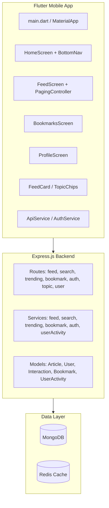
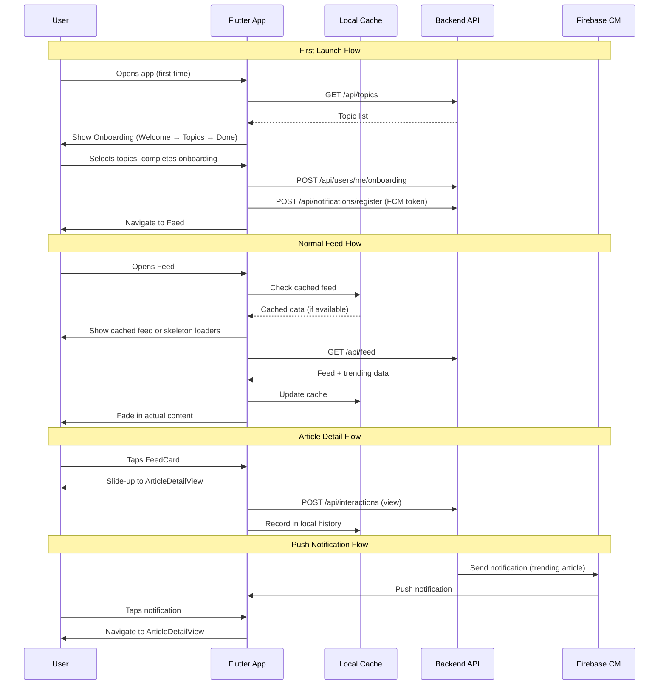

# Design Document: TrendBrief AI UX Improvements

## Overview

This design covers the transformation of TrendBrief AI from an MVP into a polished, production-quality Vietnamese AI-summarized news app. The improvements span three areas: (1) a cohesive design system with dark mode, (2) new features including onboarding, article detail view, search, trending, share, reading history, push notifications, and in-app review, and (3) UX polish including skeleton loaders, error/offline handling, micro-interactions, and expanded topic categories.

The architecture extends the existing Flutter/Provider mobile app and Express.js/MongoDB backend. The mobile app gains new screens, widgets, providers, and a local caching layer. The backend gains new endpoints for topics, reading history, user stats, push notifications, and onboarding state management.

## Architecture

### Current Architecture



### Proposed Architecture

```mermaid
graph TB
    subgraph Mobile["Flutter Mobile App (Enhanced)"]
        M_Main[main.dart + ThemeProvider + AppRouter]
        M_Onboarding[OnboardingFlow: Welcome → Topics → Done]
        M_Home[HomeScreen + AnimatedBottomNav]
        M_Feed[FeedScreen + TrendingSection + SkeletonLoaders]
        M_Detail[ArticleDetailView + InAppBrowser]
        M_Search[SearchScreen + Pagination]
        M_Bookmarks[BookmarksScreen + ErrorState]
        M_History[ReadingHistoryScreen]
        M_Profile[ProfileScreen + Stats + Settings]
        M_Widgets[EnhancedFeedCard / DynamicTopicChips / SkeletonCard / ErrorStateView / ShareSheet]
        M_Providers[ThemeProvider / OnboardingProvider / ReviewPromptService / NotificationService]
        M_Services[ApiService / AuthService / CacheService / ShareService]
        M_Cache[Local Cache: SharedPreferences + Hive]
    end

    subgraph Backend["Express.js Backend (Enhanced)"]
        B_Routes[Routes: + topics(dynamic), readingHistory, userStats, notifications, onboarding]
        B_Services[Services: + readingHistory, notification, userStats]
        B_Models[Models: + Topic, DeviceToken, NotificationLog, ReadingHistory]
    end

    subgraph External["External Services"]
        FCM[Firebase Cloud Messaging]
        APNs[Apple Push Notification Service]
    end

    Mobile --> Backend
    Backend --> MongoDB[(MongoDB)]
    Backend --> Redis[(Redis)]
    Backend --> External
```

### Key Architectural Decisions

1. **ThemeProvider with SharedPreferences**: Theme state managed via a dedicated `ChangeNotifierProvider` that persists to `SharedPreferences`. This avoids restarting the app on theme change and integrates cleanly with the existing Provider setup.

2. **Dynamic Topics from Backend**: Replace the hardcoded `AVAILABLE_TOPICS` array in `topic.routes.ts` with a MongoDB `Topic` collection. The mobile app fetches topics on startup and caches them locally. This enables adding new topics without app updates.

3. **Local Cache with Hive**: Use Hive (lightweight, no-SQL, Flutter-native) for offline feed caching and reading history. SharedPreferences handles simple key-value settings (theme, onboarding state, review prompt tracking).

4. **Firebase Cloud Messaging (FCM)**: Push notifications via FCM for both iOS and Android. The backend stores device tokens and uses a BullMQ job to send targeted notifications when articles trend.

5. **In-App Review via `in_app_review` package**: Uses platform-native StoreKit/Google Play APIs. Eligibility logic is local-only (days active, articles viewed, last prompt date) to avoid unnecessary backend calls.

6. **Article Detail View as a new screen**: Rather than opening articles externally, a dedicated `ArticleDetailView` screen renders the AI summary in-app. The "Đọc bài gốc" button uses `url_launcher` with `LaunchMode.inAppWebView`.

## Components and Interfaces

### New Flutter Components

#### Providers

| Provider | Purpose | State |
|---|---|---|
| `ThemeProvider` | Manages light/dark theme toggle | `ThemeMode`, persisted to SharedPreferences |
| `OnboardingProvider` | Tracks onboarding completion | `bool hasCompletedOnboarding`, persisted locally |

#### Screens

| Screen | Route | Description |
|---|---|---|
| `OnboardingScreen` | `/onboarding` | 3-step flow: welcome → topic selection → completion |
| `ArticleDetailScreen` | `/article/:id` | Full AI summary view with bookmark/share actions |
| `SearchScreen` | `/search` | Keyword search with infinite scroll pagination |
| `ReadingHistoryScreen` | `/history` | List of previously viewed articles |

#### Widgets

| Widget | Description |
|---|---|
| `EnhancedFeedCard` | Feed card with thumbnail, relative time, reading time badge, trending badge, entry animation |
| `TrendingCarousel` | Horizontal scrollable section of trending articles |
| `SkeletonCard` | Shimmer placeholder mimicking FeedCard layout |
| `SkeletonDetailView` | Shimmer placeholder for ArticleDetailView |
| `ErrorStateView` | Reusable error display with retry button and offline banner |
| `DynamicTopicChips` | Topic chips fetched from API instead of hardcoded |

#### Services

| Service | Description |
|---|---|
| `ShareService` | Formats share text and opens platform share sheet |
| `CacheService` | Hive-based local cache for feed data and reading history |
| `ReviewPromptService` | Tracks eligibility and triggers in-app review |
| `NotificationService` | FCM token management and notification permission handling |

### New Backend Endpoints

| Method | Path | Description |
|---|---|---|
| `GET` | `/api/topics` | Returns all topics from Topic collection (enhanced from hardcoded) |
| `GET` | `/api/users/me/stats` | Returns user reading stats: articles read, bookmarks, days active |
| `GET` | `/api/users/me/history` | Returns paginated reading history (articles viewed) |
| `POST` | `/api/users/me/onboarding` | Saves onboarding interests and marks onboarding complete |
| `POST` | `/api/notifications/register` | Registers device FCM token |
| `DELETE` | `/api/notifications/unregister` | Removes device FCM token |
| `PUT` | `/api/users/me/settings` | Updates user settings (notifications enabled, etc.) |

### Backend Services

| Service | Description |
|---|---|
| `readingHistory.service.ts` | Queries Interaction model for `view` actions, returns paginated article list |
| `userStats.service.ts` | Aggregates UserActivity for total articles read, bookmarks count, days active |
| `notification.service.ts` | Manages device tokens, sends FCM push notifications, enforces daily limit |
| `topic.service.ts` | CRUD for Topic collection, returns ordered topic list |

### Component Interaction Flow



## Data Models

### New/Modified MongoDB Collections

#### Topic Collection (New)

```typescript
interface ITopic {
  key: string;        // e.g., 'ai', 'finance', 'technology'
  label: string;      // Display name, e.g., 'AI', 'Tài chính'
  icon: string;       // Icon identifier, e.g., 'smart_toy', 'attach_money'
  color: string;      // Hex color, e.g., '#2196F3'
  order: number;      // Display order
  is_active: boolean; // Whether topic is visible
  created_at: Date;
}
```

#### DeviceToken Collection (New)

```typescript
interface IDeviceToken {
  user_id: ObjectId;
  token: string;         // FCM token
  platform: 'ios' | 'android';
  created_at: Date;
  updated_at: Date;
}
```

#### NotificationLog Collection (New)

```typescript
interface INotificationLog {
  user_id: ObjectId;
  article_id: ObjectId;
  sent_at: Date;
  type: 'trending';
}
```

#### User Model (Modified)

```typescript
// Add to existing IUser interface:
interface IUser {
  // ... existing fields ...
  interests: string[];           // Changed from Topic enum to string[] for dynamic topics
  onboarding_completed: boolean; // New: tracks onboarding state
  notifications_enabled: boolean; // New: push notification preference
  settings: {
    theme: 'light' | 'dark' | 'system';
  };
}
```

### New Flutter Models

#### TopicModel

```dart
class TopicModel {
  final String key;
  final String label;
  final String icon;
  final String color;
  final int order;

  TopicModel({...});
  factory TopicModel.fromJson(Map<String, dynamic> json);
}
```

#### UserStats

```dart
class UserStats {
  final int totalArticlesRead;
  final int totalBookmarks;
  final int daysActive;

  UserStats({...});
  factory UserStats.fromJson(Map<String, dynamic> json);
}
```

#### FeedItem (Modified)

```dart
class FeedItem {
  // ... existing fields ...
  final String? thumbnailUrl;    // New: article thumbnail image URL
  final bool isTrending;         // New: whether article is in top 5 trending
}
```

### Local Storage Schema (Hive)

```dart
// Box: 'feed_cache'
// Key: 'last_feed_page' → List<FeedItem> (JSON encoded)

// Box: 'settings'
// Key: 'theme_mode' → String ('light' | 'dark' | 'system')
// Key: 'onboarding_completed' → bool
// Key: 'review_last_prompt_date' → String (ISO date)
// Key: 'review_articles_viewed' → int
// Key: 'review_days_opened' → int
```

### Share Content Format

```
{article.titleAi}

Đọc thêm: {article.url}

via TrendBrief AI
```

### In-App Review Eligibility Criteria

```dart
bool isEligible = daysOpened >= 5 
    && articlesViewed >= 20 
    && (lastPromptDate == null || daysSinceLastPrompt >= 90);
```


## Correctness Properties

*A property is a characteristic or behavior that should hold true across all valid executions of a system — essentially, a formal statement about what the system should do. Properties serve as the bridge between human-readable specifications and machine-verifiable correctness guarantees.*

### Property 1: Theme preference round-trip

*For any* valid ThemeMode value (light, dark, system), saving the preference to local storage and reading it back should produce the same ThemeMode value.

**Validates: Requirements 1.6**

### Property 2: Onboarding topic selection validation

*For any* subset of available topics (including the empty set), the onboarding "proceed" action should be enabled if and only if the subset contains at least 1 topic.

**Validates: Requirements 2.3**

### Property 3: FeedCard thumbnail vs placeholder rendering

*For any* valid FeedItem, the FeedCard should display a thumbnail image when `thumbnailUrl` is non-null and non-empty, and should display a gradient placeholder with topic icon when `thumbnailUrl` is null or empty.

**Validates: Requirements 3.1, 3.2**

### Property 4: Relative time formatting

*For any* valid ISO 8601 timestamp representing a past date, the `formatRelativeTime` function should return a non-empty Vietnamese relative time string (containing one of: "vừa xong", "phút trước", "giờ trước", "ngày trước", "tuần trước", "tháng trước").

**Validates: Requirements 3.3**

### Property 5: Trending badge conditional rendering

*For any* valid FeedItem, the "🔥 Trending" badge should be visible if and only if the `isTrending` field is true.

**Validates: Requirements 3.5**

### Property 6: ArticleDetailView field completeness

*For any* valid FeedItem with non-empty fields, the ArticleDetailView should render all required fields: titleAi (or titleOriginal as fallback), source, publishedAt, topic badge, readingTimeSec, all summaryBullets, and reason.

**Validates: Requirements 4.2**

### Property 7: Search query minimum length validation

*For any* string input, the search should be triggered if and only if the trimmed string length is >= 2 characters.

**Validates: Requirements 5.2**

### Property 8: Trending service limit enforcement

*For any* positive integer limit value, the `getTrendingArticles` function should return at most `min(limit, 20)` items.

**Validates: Requirements 6.2**

### Property 9: Share content formatting

*For any* valid article title and URL string, the `ShareService.formatShareText` function should produce a string matching the pattern: `"{title}\n\nĐọc thêm: {url}\n\nvia TrendBrief AI"`.

**Validates: Requirements 7.2**

### Property 10: Review prompt eligibility

*For any* tuple of (daysOpened: int, articlesViewed: int, daysSinceLastPrompt: int?), the review eligibility function should return true if and only if `daysOpened >= 5` AND `articlesViewed >= 20` AND (`daysSinceLastPrompt` is null OR `daysSinceLastPrompt >= 90`).

**Validates: Requirements 8.1, 8.3**

### Property 11: Review tracking state round-trip

*For any* valid review tracking state (lastPromptDate as ISO string or null, articlesViewed as non-negative int, daysOpened as non-negative int), saving to local storage and reading back should produce an equivalent state.

**Validates: Requirements 8.4**

### Property 12: Feed cache round-trip

*For any* non-empty list of valid FeedItem objects, serializing to the local Hive cache and deserializing back should produce a list with the same length where each item has identical field values.

**Validates: Requirements 10.5**

### Property 13: Dynamic topic chips rendering

*For any* non-empty list of TopicModel items, the DynamicTopicChips widget should render exactly as many ChoiceChip widgets as there are items in the list.

**Validates: Requirements 12.2**

### Property 14: Reading history ordering

*For any* set of user view interactions with distinct timestamps, the reading history endpoint should return articles sorted by most recent view date in descending order.

**Validates: Requirements 13.1**

### Property 15: Notification targeting by topic interest

*For any* article with a given topic and any set of users with varying interest lists, the notification targeting function should return exactly the set of users whose interests include the article's topic.

**Validates: Requirements 14.2**

### Property 16: Notification daily rate limit

*For any* sequence of notification send attempts for a single user on a single day, the number of notifications actually sent should never exceed 3.

**Validates: Requirements 14.3**

## Error Handling

### Mobile App Error Handling Strategy

| Scenario | Behavior | UI |
|---|---|---|
| Feed load fails | Show `ErrorStateView` with "Thử lại" button; if cached data exists, show cached feed with error banner | Error illustration + retry button |
| Bookmarks load fails | Show `ErrorStateView` with retry button | Error illustration + retry button |
| Search fails | Show `ErrorStateView` with retry button | Error illustration + retry button |
| Trending load fails | Hide `TrendingCarousel` silently, feed continues normally | No visible error |
| Article detail load fails | Show `ErrorStateView` with retry and back button | Error illustration + retry |
| No internet | Show persistent banner "Không có kết nối mạng" at top; serve cached content where available | Yellow/orange banner |
| Share fails | Show SnackBar with error message | Brief SnackBar |
| Bookmark toggle fails | Revert optimistic UI update, show SnackBar | Brief SnackBar |
| In-app review API unavailable | Skip silently, no error shown | Nothing |
| FCM token registration fails | Retry on next app launch, no error shown | Nothing |
| Onboarding save fails | Show error SnackBar, allow retry | SnackBar + retry |
| Theme persistence fails | Fall back to system theme | No visible error |

### Backend Error Handling Strategy

| Scenario | HTTP Status | Response |
|---|---|---|
| Invalid search query (< 2 chars) | 400 | `{ error: "Query must be at least 2 characters" }` |
| Reading history for unauthenticated user | 401 | `{ error: "Unauthorized" }` |
| Topic not found | 404 | `{ error: "Topic not found" }` |
| Notification send failure (FCM) | Log error, continue | No user-facing error |
| Rate limit exceeded (notifications) | Skip notification | Logged internally |
| Database connection error | 500 | `{ error: "Internal server error" }` |
| Redis cache miss | Proceed without cache | Transparent to client |

### Retry Strategy

- Mobile: Exponential backoff for automatic retries (1s, 2s, 4s, max 3 attempts)
- Manual retry via "Thử lại" button resets the retry counter
- Backend: BullMQ job retries for notification sending (3 attempts with backoff)

## Testing Strategy

### Property-Based Testing

Property-based testing is appropriate for this feature because it contains multiple pure functions (formatting, validation, serialization) and business logic rules (eligibility, targeting, rate limiting) that should hold across a wide range of inputs.

**Library choices:**
- Dart/Flutter: `dart_check` (or `glados`) for property-based testing
- TypeScript/Node.js: `fast-check` for backend property tests

**Configuration:** Minimum 100 iterations per property test.

**Tag format:** `Feature: trendbriefai-ux-improvements, Property {number}: {property_text}`

#### Flutter Property Tests

| Property | Test File | What Varies |
|---|---|---|
| P1: Theme round-trip | `test/properties/theme_persistence_test.dart` | ThemeMode values |
| P2: Onboarding validation | `test/properties/onboarding_validation_test.dart` | Subsets of topics |
| P3: Thumbnail/placeholder | `test/properties/feed_card_thumbnail_test.dart` | FeedItems with/without thumbnailUrl |
| P4: Relative time | `test/properties/relative_time_test.dart` | Random past timestamps |
| P5: Trending badge | `test/properties/trending_badge_test.dart` | FeedItems with varying isTrending |
| P6: Detail view fields | `test/properties/article_detail_fields_test.dart` | Random FeedItem instances |
| P7: Search validation | `test/properties/search_validation_test.dart` | Random strings of varying length |
| P9: Share formatting | `test/properties/share_format_test.dart` | Random titles and URLs |
| P10: Review eligibility | `test/properties/review_eligibility_test.dart` | Random (days, articles, lastPrompt) tuples |
| P11: Review state round-trip | `test/properties/review_state_test.dart` | Random review tracking states |
| P12: Feed cache round-trip | `test/properties/feed_cache_test.dart` | Random lists of FeedItems |
| P13: Topic chips count | `test/properties/topic_chips_test.dart` | Random lists of TopicModel |

#### Backend Property Tests (fast-check)

| Property | Test File | What Varies |
|---|---|---|
| P8: Trending limit | `test/properties/trending.limit.test.ts` | Random limit values |
| P14: History ordering | `test/properties/readingHistory.ordering.test.ts` | Random sets of interactions with timestamps |
| P15: Notification targeting | `test/properties/notification.targeting.test.ts` | Random articles, random user interest sets |
| P16: Notification rate limit | `test/properties/notification.rateLimit.test.ts` | Random sequences of send attempts |

### Unit Tests (Example-Based)

Focus on specific scenarios, edge cases, and integration points:

- **Onboarding flow:** First launch shows onboarding, subsequent launches skip it
- **Error states:** Each screen shows correct error UI on network failure
- **Skeleton loaders:** Correct number of skeleton cards during loading
- **Navigation:** Tapping cards navigates to detail view
- **Bookmark toggle:** Optimistic UI update and revert on failure
- **Offline banner:** Shown when connectivity is lost
- **Profile screen:** All settings and stats sections render correctly
- **Backend endpoints:** Correct HTTP status codes and response shapes

### Integration Tests

- **Onboarding → Feed:** Complete onboarding saves interests and navigates to personalized feed
- **Search → Detail:** Search for article, tap result, view detail, verify interaction recorded
- **Notification → Deep link:** Receive notification payload, verify navigation to correct article
- **FCM token lifecycle:** Register token on login, unregister on logout
- **Cache → Offline:** Load feed, go offline, verify cached feed is displayed
