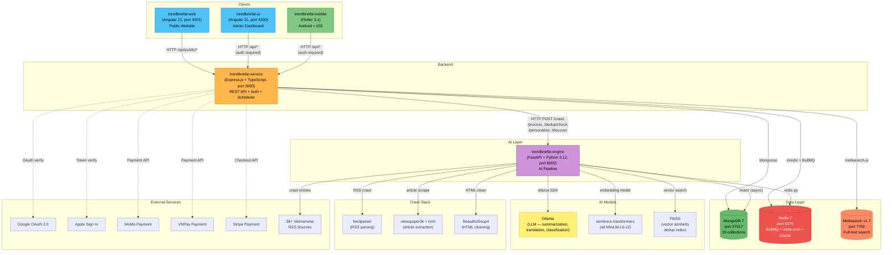
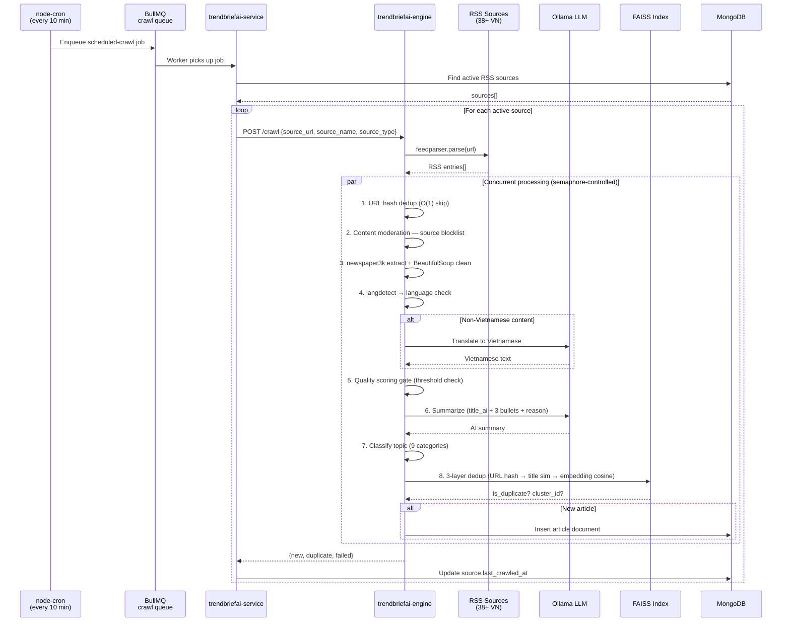
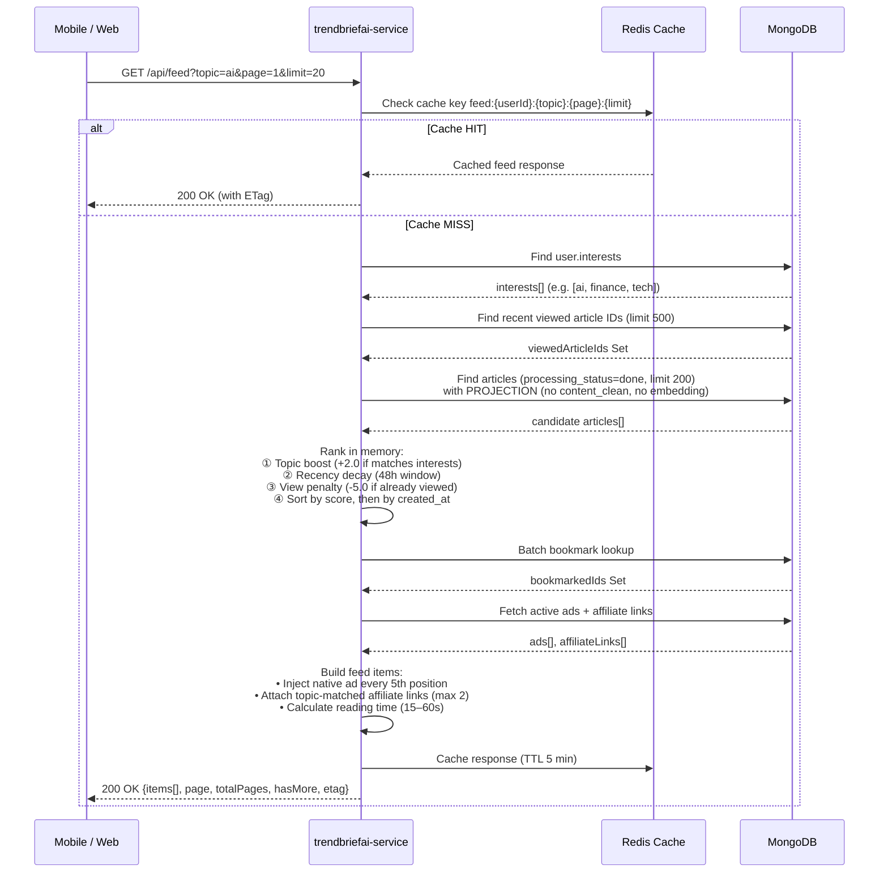
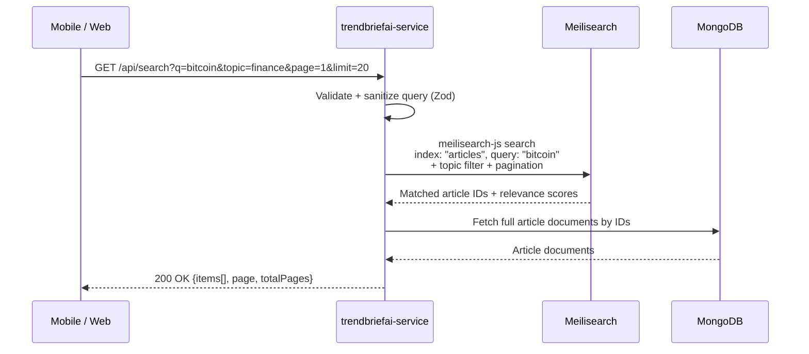
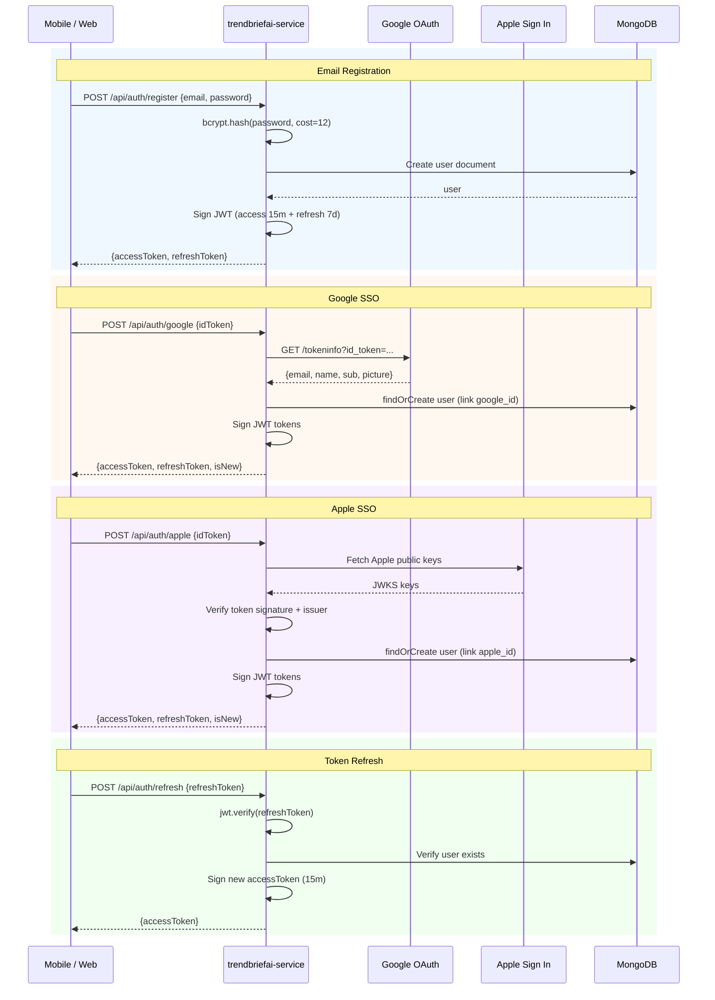
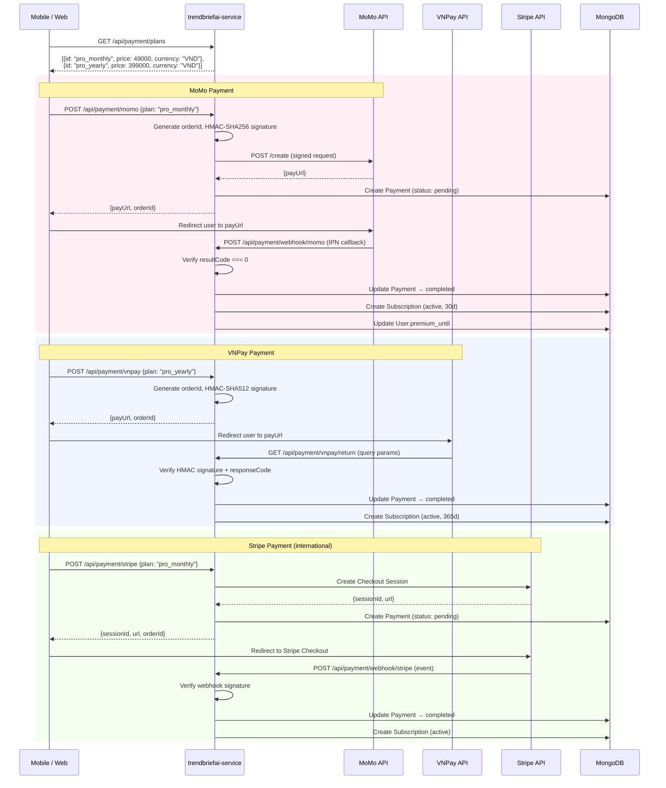
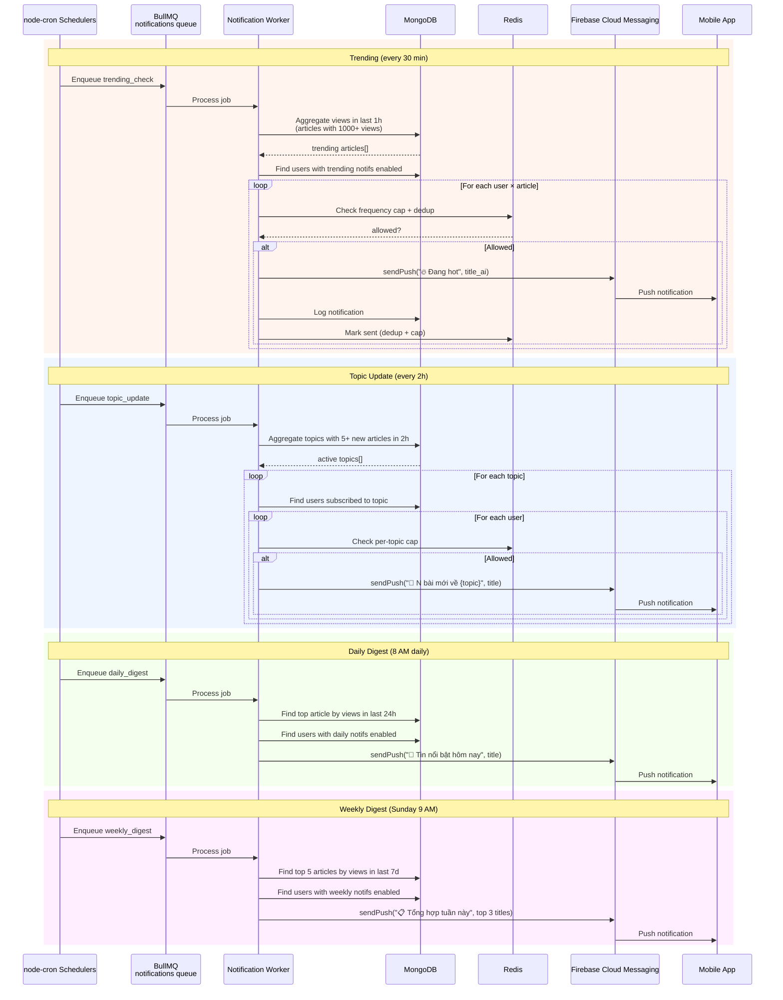
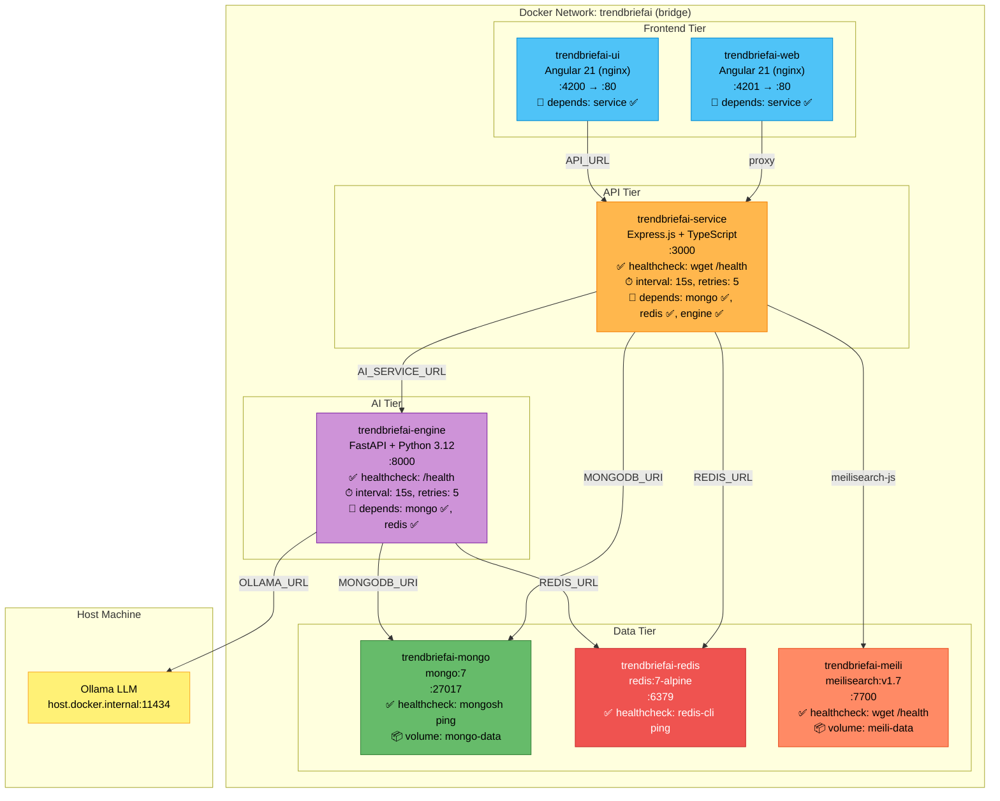
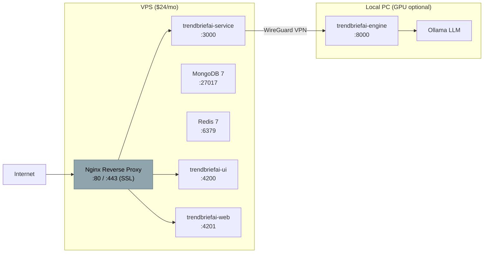

# TrendBrief AI — Architecture Documentation

> Vietnamese AI-summarized news for Gen Z. Đọc nhanh trong 30–60 giây, giảm overload thông tin.

---

## Table of Contents

1. [System Architecture](#1-system-architecture)
2. [Application Flow](#2-application-flow)
3. [Setup Guide](#3-setup-guide)
4. [Network Diagram](#4-network-diagram)
5. [Deployment Guide](#5-deployment-guide)
6. [Code Estimate](#6-code-estimate)

---

## 1. System Architecture




### Component Summary

| Component | Stack | Port | Role |
|-----------|-------|------|------|
| `trendbriefai-service` | Express.js + TypeScript + Mongoose + BullMQ | 3000 | REST API, auth, feed ranking, scheduler, payments |
| `trendbriefai-engine` | Python 3.12 + FastAPI + Ollama + FAISS | 8000 | AI crawl, summarize, classify, dedup, translate, discover |
| `trendbriefai-ui` | Angular 21 + ArchitectUI + Bootstrap 5 | 4200 | Admin dashboard (login required) |
| `trendbriefai-web` | Angular 21 + standalone components | 4201 | Public website (no login required) |
| `trendbriefai-mobile` | Flutter 3.x + Dio + Provider | — | Mobile app (Android + iOS) |
| MongoDB 7 | Document database | 27017 | Articles, users, interactions, payments, subscriptions |
| Redis 7 | Cache + message queue | 6379 | BullMQ job queues, feed cache (5min TTL), rate limiting |
| Meilisearch v1.7 | Full-text search engine | 7700 | Fast article search, typo-tolerant queries |

---

## 2. Application Flow

### 2.1 News Ingestion Pipeline



### 2.2 Personalized Feed



### 2.3 Article Search



### 2.4 User Authentication



### 2.5 Payment / Subscription Flow




### 2.6 Push Notification Flow



### Notification Schedule Summary

| Type | Schedule | Trigger Condition | Content |
|------|----------|-------------------|---------|
| `trending` | Every 30 min | Article with 1000+ views in 1h | "🔥 Đang hot" + title |
| `topic_update` | Every 2h | 5+ new articles in subscribed topic | "📌 N bài mới về {topic}" |
| `daily_digest` | 8 AM daily | Top article by views in 24h | "📰 Tin nổi bật hôm nay" |
| `weekly_digest` | Sunday 9 AM | Top 5 articles by views in 7d | "📋 Tổng hợp tuần này" |

---

## 3. Setup Guide

### 3.1 Prerequisites

- Docker + Docker Compose
- Node.js 20+ (for local dev)
- Python 3.12+ (for local dev)
- Flutter 3.x (for mobile dev)
- Ollama installed with a model (e.g. `ollama pull llama3.2`)

### 3.2 Docker Setup (Recommended)

7 containers orchestrated via `docker-compose.yml`:

```bash
# 1. Clone and configure
cp .env.example .env
# Edit .env with your secrets (JWT, OAuth, payment keys)

# 2. Start all services
docker compose up -d

# 3. Verify health
docker compose ps
curl http://localhost:3000/health   # → {"status":"ok"}
curl http://localhost:8000/health   # → {"status":"ok","models":{...}}
```

| Container | Image | Port | Healthcheck |
|-----------|-------|------|-------------|
| `trendbriefai-mongo` | mongo:7 | 27017 | `mongosh --eval "db.adminCommand('ping')"` |
| `trendbriefai-redis` | redis:7-alpine | 6379 | `redis-cli ping` |
| `trendbriefai-engine` | ./trendbriefai-engine | 8000 | `urllib.request.urlopen('http://localhost:8000/health')` |
| `trendbriefai-service` | ./trendbriefai-service | 3000 | `wget --spider http://localhost:3000/health` |
| `trendbriefai-ui` | ./trendbriefai-ui | 4200 | nginx serves static |
| `trendbriefai-web` | ./trendbriefai-web | 4201 | nginx serves static |
| `trendbriefai-meili` | getmeili/meilisearch:v1.7 | 7700 | `wget --spider http://localhost:7700/health` |

### 3.3 Manual Setup

```bash
# 1. Start MongoDB + Redis
docker run -d --name trendbriefai-mongo -p 27017:27017 mongo:7
docker run -d --name trendbriefai-redis -p 6379:6379 redis:7-alpine

# 2. Seed database
mongosh mongodb://localhost:27017/trendbriefai < database/001_init_collections.js
mongosh mongodb://localhost:27017/trendbriefai < database/002_seed_rss_sources.js
mongosh mongodb://localhost:27017/trendbriefai < database/003_seed_topics.js

# 3. Start AI Engine
cd trendbriefai-engine
pip install -r requirements.txt
uvicorn api:app --host 0.0.0.0 --port 8000

# 4. Start Backend
cd trendbriefai-service
npm install
npm run dev

# 5. Start Admin UI
cd trendbriefai-ui
npm install && ng serve --port 4200

# 6. Start Public Website
cd trendbriefai-web
npm install && ng serve --port 4201

# 7. Start Mobile
cd trendbriefai-mobile
flutter pub get && flutter run
```

### 3.4 Seed Data

The `database/` folder contains initialization scripts that run automatically on first Docker start:

| Script | Purpose |
|--------|---------|
| `001_init_collections.js` | Create collections + indexes (text, compound, TTL) |
| `002_seed_rss_sources.js` | Seed 38+ Vietnamese RSS sources |
| `003_seed_topics.js` | Seed 9 topic categories |

---

## 4. Network Diagram



### Dependency Chain

```
mongo (healthy) ──┐
                  ├──→ trendbriefai-engine (healthy) ──→ trendbriefai-service (healthy) ──┬──→ trendbriefai-ui
redis (healthy) ──┘                                                                       └──→ trendbriefai-web
meilisearch (healthy) ──→ trendbriefai-service
```

All containers use `restart: unless-stopped` and health-dependent startup ordering.

---

## 5. Deployment Guide

### 5.1 Development (Docker Compose)

```bash
docker compose up -d
# All 7 containers (service, engine, web, ui, MongoDB, Redis, Meilisearch) on localhost
# Ollama runs on host machine (host.docker.internal:11434)
```

### 5.2 Production (VPS — ~$24/month)

Recommended: 4 vCPU, 8 GB RAM VPS (Vultr/DigitalOcean/Hetzner).



Production checklist:
- Set `NODE_ENV=production` and strong `JWT_SECRET`
- Enable SSL via Let's Encrypt + Nginx
- Configure firewall (only 80/443 open)
- Set up MongoDB authentication
- Use PM2 or systemd for process management
- Configure log rotation

### 5.3 Hybrid Deployment (AI on Local PC)

The AI engine is the most resource-intensive component (Ollama LLM + sentence-transformers + FAISS). Run it on a local PC with GPU while keeping lightweight services on VPS.

Connection: WireGuard VPN tunnel between VPS and local PC.

```bash
# On VPS: point AI_SERVICE_URL to local PC via VPN
AI_SERVICE_URL=http://10.0.0.2:8000  # WireGuard IP of local PC

# On Local PC: run AI engine
cd trendbriefai-engine
OLLAMA_URL=http://localhost:11434 uvicorn api:app --host 0.0.0.0 --port 8000
```

Cost breakdown:
| Component | Location | Cost |
|-----------|----------|------|
| VPS (4 vCPU, 8 GB) | Cloud | ~$24/mo |
| AI Engine + Ollama | Local PC | $0 (electricity only) |
| Domain + SSL | Cloudflare | Free |
| MongoDB Atlas (optional) | Cloud | Free tier / $9/mo |

### 5.4 Mobile Deployment

```bash
# Android
cd trendbriefai-mobile
flutter build apk --release
# Output: build/app/outputs/flutter-apk/app-release.apk

# iOS
flutter build ios --release
# Then archive via Xcode → App Store Connect

# Update API base URL for production
# lib/config/api_config.dart → https://api.trendbriefai.com
```

---

## 6. Code Estimate

### trendbriefai-service (Express.js + TypeScript)

| Category | Count | Files |
|----------|-------|-------|
| Routes | 20 | auth, feed, bookmark, interaction, topic, user, search, trending, ad, affiliate, analytics, notification, public, source, admin, article, referral, reaction, payment, image |
| Models | 19 | User, Article, Bookmark, Interaction, Topic, RssSource, Ad, AffiliateLink, Analytics, Cluster, DeviceToken, NotificationLog, Payment, Reaction, Referral, Subscription, ArticleReport, UserActivity, SummaryFeedback |
| Services | 20 | auth, sso, feed, bookmark, interaction, search, trending, ad, affiliate, affiliateSearch, analytics, notification, payment, referral, readingHistory, related, topic, userActivity, userStats, meiliSearch |
| Workers | 2 | crawl.worker, notification.scheduler |
| Middleware | 3 | auth, rateLimit, validate |
| Config | 2 | index, swagger |
| Types | 2 | api.types, schemas |
| DB | 1 | connection |
| Entry | 1 | index.ts |
| **Total** | **68 files** | ~**6,800 lines** |

### trendbriefai-engine (Python 3.12 + FastAPI)

| Category | Count | Files |
|----------|-------|-------|
| API | 1 | api.py (endpoints: /health, /crawl, /process, /dedup/check, /translate, /discover, /summarize-url, /briefing, /personalize) |
| Pipeline | 1 | pipeline.py |
| Services | 10 | crawler, scraper, cleaner, summarizer, classifier, translator, discovery, quality_scorer, content_moderator, __init__ |
| Dedup | 6 | core, embedding, faiss_index, similarity, utils, __init__ |
| Cache | 3 | redis_cache, summarizer_cache, __init__ |
| Models | 3 | article, source, __init__ |
| Config | 1 | config.py |
| DB | 2 | connection, __init__ |
| Tests | 11 | test_classifier, test_cleaner, test_crawler, test_embedding, test_faiss, test_pipeline, test_quality_scorer, test_redis_cache, test_summarizer_cache, test_summarizer, __init__ |
| **Total** | **38 files** | ~**3,800 lines** |

### trendbriefai-ui (Angular 21 — Admin Dashboard)

| Category | Count | Files |
|----------|-------|-------|
| Pages | 13 | feed, bookmarks, login, register, profile, admin/sources, admin/analytics, admin/ads, admin/affiliates, admin/users, admin/notifications, admin/moderation |
| Layout | 3 | layout, header, sidebar |
| Services | 2 | api, auth |
| Guards | 1 | auth.guard |
| Interceptors | 1 | auth.interceptor |
| Types | 1 | api.types |
| Config | 4 | app.component, app.config, app.routes, environments (×2) |
| **Total** | **~25 files** | ~**3,000 lines** |

### trendbriefai-web (Angular 21 — Public Website)

| Category | Count | Files |
|----------|-------|-------|
| Pages | 8 | feed, article, search, login, payment, privacy, terms, referral |
| Layout | 1 | layout (header + footer) |
| Components | 1 | newsletter |
| Services | 4 | api, auth, analytics, seo |
| Config | 4 | app.component, app.config, app.routes, environments (×2) |
| Assets | 3 | styles.css, design-system.css, sw.js |
| **Total** | **~21 files** | ~**2,500 lines** |

### trendbriefai-mobile (Flutter 3.x)

| Category | Count | Files |
|----------|-------|-------|
| Screens | 11 | home, feed, article_detail, search, bookmarks, login, register, onboarding, profile, premium, reading_history |
| Services | 9 | api, auth, notification, analytics, cache, share, admob, crash_reporting, review_prompt |
| Models | 5 | feed_item, user_profile, auth_tokens, topic_model, user_stats |
| Widgets | 8 | feed_card, enhanced_feed_card, skeleton_card, skeleton_detail_view, topic_chips, dynamic_topic_chips, trending_carousel, error_state_view |
| Providers | 2 | onboarding, theme |
| Config | 3 | api_config, app_theme, firebase_options |
| Utils | 2 | time_formatter, validators |
| Entry | 1 | main.dart |
| **Total** | **~41 files** | ~**5,200 lines** |

### Grand Total

| Module | Files | Est. Lines |
|--------|-------|------------|
| trendbriefai-service | 68 | ~6,800 |
| trendbriefai-engine | 38 | ~3,800 |
| trendbriefai-ui | 25 | ~3,000 |
| trendbriefai-web | 21 | ~2,500 |
| trendbriefai-mobile | 41 | ~5,200 |
| database (seeds) | 4 | ~400 |
| docker + config | 5 | ~200 |
| **Total** | **~202 files** | **~22,700 lines** |
